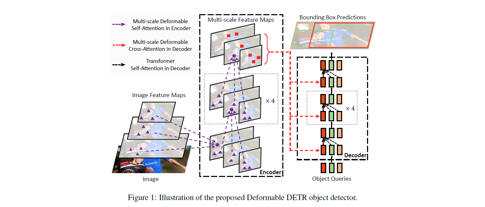

# Deformable DTER for windows
Deformable DTER for windows and includes a reasoning implementation of Deformable DTER

When I tried to test [Deformable DETR](https://github.com/fundamentalvision/Deformable-DETR) on windows, I found that I could not import `MultiScaleDeformableAttention`. \
So I followed the instructions to execute `make.sh`, but it did not work. \
After checking the source code I found that the underlying `MultiScaleDeformableAttention` is written in **c++**.\
So I configured the `clang` environment to compile the **c++** files in the project and it finally worked.\
The process was unquestionably a headache, so for your convenience I've brought the compiled project here and created a notebook for you to use for Deformable DETR reasoning. \
Here it is [deformable_detr](https://github.com/Elm-Forest/deformable-detr-win/blob/master/deformable_detr.ipynb) 

  

### Preparation
Download the [Deformable DETR weights](https://drive.google.com/file/d/1nDWZWHuRwtwGden77NLM9JoWe-YisJnA/view?usp=sharing) ,and put it in the root content\
And if you want to try other weights ,here it is

| Method   | Epochs | AP | APS | APM | APL | params (M) | FLOPs (G) | Total Train Time (GPU hours) | Train Speed (GPU hours /epoch) | Infer Speed (FPS) | Batch Infer Speed (FPS) | URL                     |
| ----------------------------------- | :----: | :--: | :----: | :---: | :------------------------------: | :--------------------:| :----------------------------------------------------------: | :--: | :---: | :---: | ----- | ----- |
| **Deformable DETR (single scale)** | 50 | 39.4 | 20.6 | 43.0 | 55.5 | 34 |78|160|3.2|27.0|42.4| [config](./configs/r50_deformable_detr_single_scale.sh) [log](https://drive.google.com/file/d/1n3ZnZ-UAqmTUR4AZoM4qQntIDn6qCZx4/view?usp=sharing) [model](https://drive.google.com/file/d/1WEjQ9_FgfI5sw5OZZ4ix-OKk-IJ_-SDU/view?usp=sharing) |
| **Deformable DETR (single scale, DC5)** | 50 | 41.5 | 24.1 | 45.3 | 56.0 | 34 |128|215|4.3|22.1|29.4| [config](./configs/r50_deformable_detr_single_scale_dc5.sh) [log](https://drive.google.com/file/d/1-UfTp2q4GIkJjsaMRIkQxa5k5vn8_n-B/view?usp=sharing) [model](https://drive.google.com/file/d/1m_TgMjzH7D44fbA-c_jiBZ-xf-odxGdk/view?usp=sharing) |
| **Deformable DETR** | 50 | 44.5 | 27.1 | 47.6 | 59.6 | 40 |173|325|6.5|15.0|19.4|[config](./configs/r50_deformable_detr.sh) [log](https://drive.google.com/file/d/18YSLshFjc_erOLfFC-hHu4MX4iyz1Dqr/view?usp=sharing) [model](https://drive.google.com/file/d/1nDWZWHuRwtwGden77NLM9JoWe-YisJnA/view?usp=sharing)                   |
| **+ iterative bounding box refinement** | 50 | 46.2 | 28.3 | 49.2 | 61.5 | 41 |173|325|6.5|15.0|19.4|[config](./configs/r50_deformable_detr_plus_iterative_bbox_refinement.sh) [log](https://drive.google.com/file/d/1DFNloITi1SFBWjYzvVEAI75ndwmGM1Uj/view?usp=sharing) [model](https://drive.google.com/file/d/1JYKyRYzUH7uo9eVfDaVCiaIGZb5YTCuI/view?usp=sharing) |
| **++ two-stage Deformable DETR** | 50 | 46.9 | 29.6 | 50.1 | 61.6 | 41 |173|340|6.8|14.5|18.8|[config](./configs/r50_deformable_detr_plus_iterative_bbox_refinement_plus_plus_two_stage.sh) [log](https://drive.google.com/file/d/1ozi0wbv5-Sc5TbWt1jAuXco72vEfEtbY/view?usp=sharing)  [model](https://drive.google.com/file/d/15I03A7hNTpwuLNdfuEmW9_taZMNVssEp/view?usp=sharing) |
